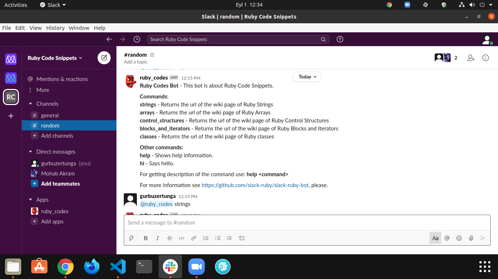

# Ruby Capstone Project - Slack Bot

> This is a Slack Bot Project for Ruby learners. I chose this subject as a newbie in programming I always need reminders about code blocks as well.

My version of the Slack bot will return basic concepts of ruby as a reminder to you. For example if you type @your_bot strings, you'll be led to a wiki page of ruby strings. Same works with arrays, classes etc. For full list of commands type @your_bot help in your channel



## Built With
* Ruby
* Slack API
* Ruby Gems
* slack-ruby-bot Gem
* Rubocop

## Video Explanation

Here is the [video explanation](https://www.loom.com/share/c6738ee94321498bacc9f3c6eb38448e) of this project.

## Prerequisities

To get this project up and running locally, you must already have ruby and necessary gems installed on your computer.

### Installation

**Step 1**<br>
Navigate through the local folder where you want to clone the repository and write<br>
``` git clone git@github.com:gurbuzertunga/ruby_slack_bot.git```. It will clone the repo to your local folder.<br>
or with https<br>
```git clone https://github.com/gurbuzertunga/ruby_slack_bot.git```.<br>
**Step 2**<br>
Run ```cd ruby_slack_bot```<br>
**Step 3**<br>
Run ```bundle install``` to get the necesary gems.<br>
**Step 4**<br>
Create a [workspace](https://slack.com/get-started#/create) and follow the instructions and get a 'OAuth Access Token'.<br>
**Step5**<br>
When you are at your dashboard click 'Your Apps' section at top right corner and from there create an app and install your app to the workspace with 'admin' and 'chat:write' scopes. Those scopes are under the 'OAuths&Permissions' tab.<br>
**Step 6**<br>
Add 'incoming-webhooks', 'im:write', 'chat:write', 'channels:history', 'app_mentions:read', 'commands' scopes to the Bot Token Scopes at the same page. Then copy your TOKEN to an .env file in your repository and paste it to ```SLACK_BOT_TOKEN= your-token-here```<br>
**Step 8**<br>
Run ```rackup``` to run the rack  from your terminal window. It needs to be run to create a local server and make a tunnel to the internet.<br>
**Step 12**<br>
Open the Slack and go to workspace page. Invite your bot to your page. To see available commands ask for @your_bot help.
List of available commands: are as follows:<br>
@your_bot strings: Returns the url of the wiki page of Ruby Strings<br>
@your_bot arrays: Returns the url of the wiki page of Ruby Arrays<br>
@your_bot blocks_and_iterators: Returns the url of the wiki page of Ruby Blocks and Iterators<br>
@your_bot classes: Returns the url of the wiki page of Ruby Classes<br>
@your_bot help: Returns the full list of commands<br>
**Step 13**<br>
It will answer you and follow the instructions of help to interact.<br>
**Step 14**<br>
Enjoy!<br>

## Authors

:bust_in_silhouette:**Gürbüz Ertunga**
- Github: [@gurbuzertunga](https://github.com/gurbuzertunga)
- LinkedIn: [@Gurbuz Ertunga](https://www.linkedin.com/in/gurbuz-ertunga-a607a2a5/)
  
## :handshake: Contributing

## Show your support
If you've read this far, you must like the project! Give us a :star:️!   

## Acknowledgments
- Our thanks to Microverse and all our peers and colleagues there.

## :memo: License
This project has no license  